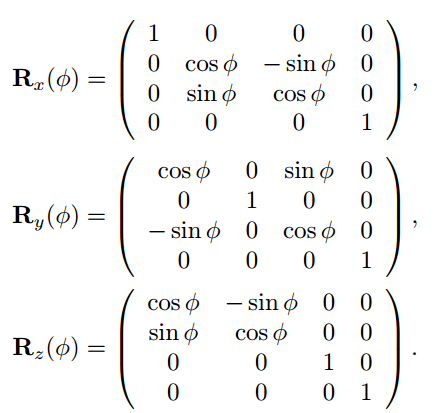

# rigid-body transform

The rigid transformations include *rotations*, *translations*, reflections, or their combination.

Any rigid-body matrix, X, can be written as the concatenation of a translation matrix, T(t), and a rotation matrix, R. 

Any object will keep the same shape and size after a proper rigid transformation.

All rigid transformations are examples of *affine transformations*

# Orthogonal Matrix 正交矩阵

An orientation matrix is a rotation matrix associated with a camera view or object that defines its orientation in space

All rotation matrices have a determinant of one and are orthogonal.

#  affine transformations.

Examples of affine transformations include translation, scaling, homothety, similarity transformation, reflection, rotation, shear mapping, and compositions of them in any combination and sequenc
